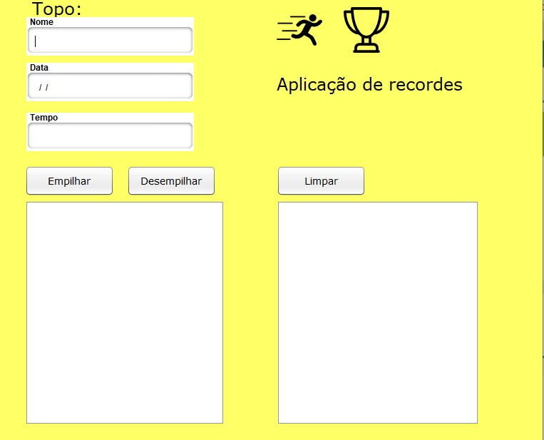

# PilhaGraficaJava

Aplicação para controlar recordes em Java/Java Swing utilizando Apache Netbeans

- Verificação do tempo do novo recorde:

*Antes de adicionar um novo recorde à pilha principal, o tempo precisa ser verificado.
*Isso pode ser feito usando um cronômetro ou outro método de medição de tempo.

- Movimentação de um recorde da pilha principal para a pilha auxiliar:
  
*Um recorde pode ser movido da pilha principal para a pilha auxiliar por vários motivos.
*Isso pode ser feito manualmente ou automaticamente.

- Visualização das pilhas em tempo real nas áreas de listagem:

*As pilhas podem ser visualizadas em tempo real nas áreas de listagem.
*Isso permite que os usuários acompanhem o status dos recordes.

Menu da aplicação: 

  

